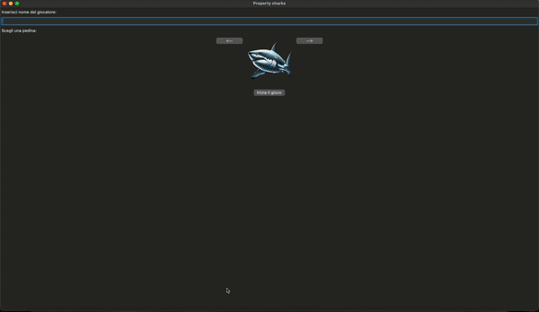

# Property-sharks

## This project is a digital adaptation of the classic board game Monopoly

## **Installation**

1. **Clone the repository**:
   git clone https://github.com/gdmr/property-sharks.git

2. **Navigate to the project directory**:
    cd property-sharks

3. **Compile the project using Make**:
   make

4. **Run the game**:
   ./inizio

5. **Have fun**: 

Note: As the game is still under development, it may contain some bugs. We appreciate your understanding and welcome any feedback or bug reports.